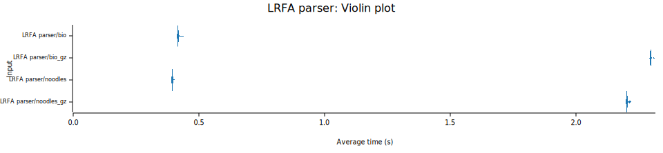
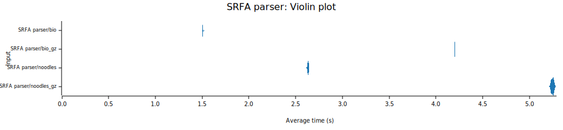
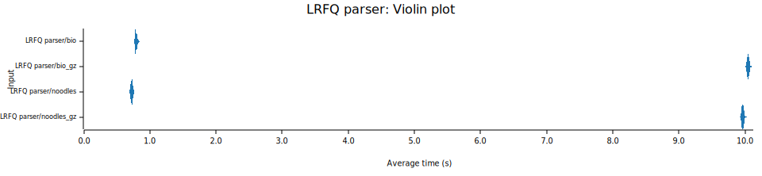
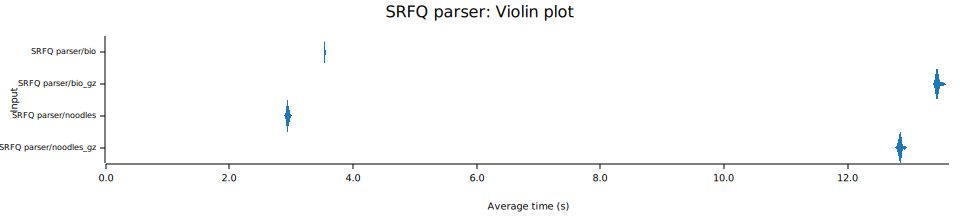
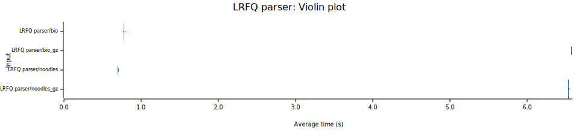
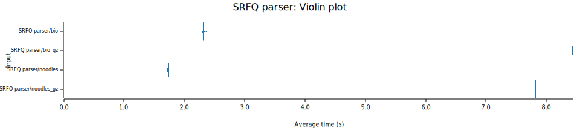

# FASTX I/O Benchmark Report

This report summarizes the performance benchmarks for the project using `Criterion.rs`.
Benchmark the performance of reading a FASTX file exhausted. 


## FASTX libraries

| Crate | Version | FASTA | FASTQ | Faidx | FASTX | Async | Parallel | Auto Compression detection | SR | LR | multi-line FASTA |
|:-----:|:-------:|:-----:|:-----:|:-----:|:-----:|:-----:|:--------:|:--------------------------:|:--:|:--:|:----------------:|
| bio::io       | v3.0.0  | V | V | V | Record |   |   |   | V | V | V |
| noodles-fasta | v0.57.0 | V |   | V |        | V |   |   | V | V | V |
| noodles-fastq | v0.21.0 |   | V | V |        | V |   |   | V | V |   |
| fastq         | v0.6.0  |   | V |   | V |   | V | gzip, lz4 | V |   |   |
| seq_io        | v0.3.4  | V | V |   | V |   | V |  |   |   | V | V |
| fxread        | v | V | V |  |  | V |  |  | 
| needletail    | v |  |  |
| kseq          | v |  |  |
| rust-htslib   | v |  |  |


- **FASTA** : FASTA reader and writer.  
- **FASTQ** : FASTQ reader and writer.
- **Faidx** : FASTA reader with an index created by SAMtools ( `.fai` ).
- **FASTX** : Automatically detects the right reader (FASTA or FASTQ).
- **Parallel** : Support a function to read records in a different thread.
- **Async** : Support Async.
- **FASTXRecord**: The crate provide traits or utilities to read and write FASTA and FASTQ interchangably when the type of a file is not known at compile time.
- **multi-line FASTA**: FASTA parser can read and write multi-line files.

## Datasets

### 1. Download AshkenazimTrio son (HG002) sequencing data from GIAB 

| Read | Dataset | File Name | File Size | 
|:----:|:-------:|:---------:|:---------:|
|  Short-read (SR)  |  NIST_Illumina_2x250bps  |  D1_S1_L001_R1_001.fastq.gz  | 5.6G |
|  Long-read (LR)  |  UCSC_Ultralong_OxfordNanopore_Promethion  |  GM24385_1.fastq.gz  | 27G | 

### 2. Sample subset from the original FASTQ files

- Because the dataset is too large to iterate, I extracted a subset for benchmarking.
    ```
    # Sampling LR dataset with sample fraction 0.05
    seqtk_rs sample -I ${FASTQ} --random-seed 11 -f 0.05 | gzip > ${SUBSET_FQ}

    # Sampling SR dataset with sample fraction 0.2
    seqtk_rs sample -I ${FASTQ} --random-seed 11 -f 0.2 | gzip > ${SUBSET_FQ}

    # Calculate FASTA/FASTQ statistics
    # Output: #seq, #bases, avg_size, min_size, med_size, max_size, N50
    seqtk_rs size -A ${FASTA}
    seqtk_rs size -I ${FASTQ}

    ```

- The stats of subsets:
    | Read | Subset Name | File Size | #Sequences | #Bases | Avg. Size | Min. Size | Median Size | Max Size | N50 |
    |:----:|:-----------:|:---------:|:----------:|:------:|:---------:|:---------:|:-----------:|:--------:|:---:|
    |  SR  | D1_S1_L001_R1_001_subset.fastq.gz | 1.1G | 6,785,633 | 1,684,541,053 | 248.25 | 35 | 250 | 250 | 250 |
    |  LR  | GM24385_1_subset.fastq.gz | 1.3G | 145,025 | 1,325,261,486 | 9,138.16 | 5 | 1,043 | 290,123 | 50,242 |

### 3. Generate FASTA file from the FASTQ files by `seqtk_rs`

- Generate FASTA file:

    ```
    seqtk_rs seq -I ${FASTQ} --output-fasta | gzip > ${FASTA}

    ```


## Environment

|  | Env1 | Env2 |
|------|-------|-------|
| CPU Model | Apple M1 Pro | AMD Ryzen 5 5560U with Radeon Graphics |
| CPU Cores/Tgreads | 8/8 (6p+2e) | 6/2 |
| CPU Architecture | ARM64 | x86_64 |
| Memory | 16 GB (LPDDR5) | 8G + 16 GB (DDR4) 3200 MT/s |
| Storage | 494.38 GB (APPLE SSD AP0512R) | 512 GB (INTEL SSDPEKNU512GZ) NVMe PCIe |
| OS | macOS Sequoia 15.6.1  | Ubuntu 22.04.5 |
| Rust Version  | 1.89.0  | 1.91.1 |
| Criterion Version  | 0.7.0  | 0.7.0 |

## Result 1: FASTA data

- test with own FASTX detecter or the lib provide FASTX detecter?

Benchmark the performance of reading a FASTA file exhausted and calculate the number of bases for each each nucleotides (ACTGN).

- Configure `Criterion` with a `sample_size` (number of iterations) of 30 for this benchmark. 

### Summary Table

| Environment | Read Type | Benchmark | Compressed | Mean Time | Std Dev | Median Time | MAD |
|:-----------:|:---------:|:---------:|:----------:|:---------:|:-------:|:-----------:|:---:|
| env1 | LR | bio:io | - | 413.88 ms | 413.88 ms | 412.62 ms | 2.3413 ms |
| env1 | LR | bio:io | gz | 3.5425 s | 4.4399 ms | 3.5428 s | 3.9667 ms |
| env1 | LR | noodles | - | 469.22 ms | 11.802 ms | 466.73 ms | 5.0736 ms |
| env1 | LR | noodles | gz | 3.5878 s | 18.284 ms | 3.5836 s | 6.0430 ms |
| env1 | SR | bio:io | - | 2.3768 s | 15.807 ms | 2.3751 s | 16.818 ms |
| env1 | SR | bio:io | gz | 6.9366 s | 33.007 ms | 6.9267 s | 42.735 ms |
| env1 | SR | noodles | - | 4.2773 s | 95.159 ms | 4.3037 s | 97.323 ms |
| env1 | SR | noodles | gz | 8.6527 s | 36.053 ms | 8.6564 s | 37.001 ms |
| env2 | LR | bio:io | - | 419.00 ms | 3.7700 ms | 417.87 ms |  414.20 µs |
| env2 | LR | bio:io | gz | 2.2982 s | 3.2129 ms | 2.2972 s | 332.83 µs |
| env2 | LR | noodles | - | 396.37 ms | 3.6894 ms | 395.44 ms | 327.80 µs |
| env2 | LR | noodles | gz | 2.2045 s | 3.7695 ms | 2.2029 s | 376.05 µs |
| env2 | SR | bio:io | - | 1.5070 s | 2.5284 ms | 1.5062 s | 814.41 µs |
| env2 | SR | bio:io | gz | 4.2002 s | 2.4028 ms | 4.2002 s | 555.40 µs |
| env2 | SR | noodles | - | 2.6323 s | 5.5215 ms | 2.6347 s | 4.5802 ms |
| env2 | SR | noodles | gz |  5.2459 s | 12.452 ms | 5.2475 s | 15.822 ms |

### Violin Plot
- Environment 1

    
    

- Environment 2

    
    

## Result 2: FASTQ data

- **fastq** failed when running LR dataset with error message: Custom { kind: InvalidData, error: "Fastq record is too long" }. Fastq can run multiple threads by defining RecordSets. 

### Summary Table
| Environment | Read Type | Benchmark | Compressed | Mean Time | Std Dev | Median Time | MAD |
|:-----------:|:---------:|:---------:|:----------:|:---------:|:-------:|:-----------:|:---:|
| env1 | LR | bio:io | - | 792.03 ms | 13.858 ms | 787.35 ms | 12.927 ms |
| env1 | LR | bio:io | gz | 10.046 s | 15.543 ms | 10.046 s | 15.780 ms |
| env1 | LR | noodles | - | 726.06 ms | 13.694 ms | 728.48 ms | 15.766 ms |
| env1 | LR | noodles | gz | 9.9639 s | 14.840 ms | 9.9636 s | 17.617 ms |
| env1 | SR | bio:io | - | 3.5446 s | 5.9064 ms | 3.5453 s | 5.6335 ms |
| env1 | SR | bio:io | gz | 13.455 s | 35.220 ms | 13.447 s | 23.869 ms |
| env1 | SR | noodles | - | 2.9467 s | 19.552 ms | 2.9448 s | 16.888 ms |
| env1 | SR | noodles | gz | 12.851 s | 28.525 ms | 12.849 s | 20.484 ms |
| env2 | LR | bio:io | - | 779.72 ms | 4.2280 ms | 778.94 ms | 702.97 µs |
| env2 | LR | bio:io | gz | 6.5685 s | 2.4057 ms | 6.5676 s | 1.6872 ms |
| env2 | LR | noodles | - | 706.56 ms | 5.1516 ms | 705.34 ms | 216.01 µs |
| env2 | LR | noodles | gz | 6.5323 s | 3.4865 ms | 6.5313 s | 1.6310 ms |
| env2 | SR | bio:io | - | 2.3151 s | 8.1311 ms | 2.3160 s | 1.9802 ms |
| env2 | SR | bio:io | gz | 8.4290 s | 3.2871 ms | 8.4287 s | 2.9692 ms |
| env2 | SR | noodles | - | 1.7345 s | 6.5779 ms | 1.7359 s | 6.7096 ms |
| env2 | SR | noodles | gz | 7.8239 s | 4.6098 ms | 7.8227 s | 2.1434 ms |


### Violin Plot

- Environment 1

    
    

- Environment 2

    
    


## Conclusion