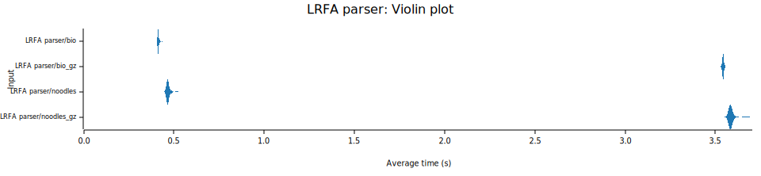
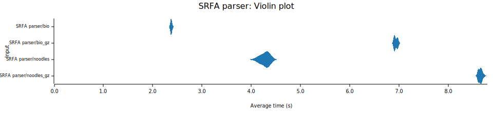

# FASTX I/O Benchmark Report

This report summarizes the performance benchmarks for the project using `Criterion.rs`.

## FASTQ/FASTA libs

- **bio**: bio::io v3.0.0
- **noodles**: 
    - noodles-fasta v0.57.0
    - noodles-fastq v0.21.0

## Datasets

### 1. Download AshkenazimTrio son (HG002) sequencing data from GIAB 

| Read | Dataset | File Name | File Size | 
|:----:|:-------:|:---------:|:---------:|
|  Short-read (SR)  |  NIST_Illumina_2x250bps  |  D1_S1_L001_R1_001.fastq.gz  | 5.6G |
|  Long-read (LR)  |  UCSC_Ultralong_OxfordNanopore_Promethion  |  GM24385_1.fastq.gz  | 27G | 

### 2. Sample subset from the original FASTQ files

- Because the dataset is too large to iterate, I extracted a subset for benchmarking.
    ```
    # Sampling LR dataset with sample fraction 0.05
    seqtk_rs sample -I ${FASTQ} --random-seed 11 -f 0.05 | gzip > ${SUBSET_FQ}

    # Sampling SR dataset with sample fraction 0.2
    seqtk_rs sample -I ${FASTQ} --random-seed 11 -f 0.2 | gzip > ${SUBSET_FQ}

    ```

- The stats of subsets:
    | Read | Subset Name | File Size | #Sequences | #Bases | Avg. Size | Min. Size | Median Size | Max Size | N50 |
    |:----:|:-----------:|:---------:|:----------:|:------:|:---------:|:---------:|:-----------:|:--------:|:---:|
    |  SR  | D1_S1_L001_R1_001_subset.fastq.gz | 1.1G | 6,785,633 | 1,684,541,053 | 248.25 | 35 | 250 | 250 | 250 |
    |  LR  | GM24385_1_subset.fastq.gz | 1.3G | 145,025 | 1,325,261,486 | 9,138.16 | 5 | 1,043 | 290,123 | 50,242 |

### 3. Generate FASTA file from the FASTQ files by `seqtk_rs`

- Generate FASTA file:

    ```
    seqtk_rs seq -I ${FASTQ} --output-fasta | gzip > ${FASTA}

    ```

- Check Files by `seqtk_rs`

    ```
    # Output: #seq, #bases, avg_size, min_size, med_size, max_size, N50
    seqtk_rs size -A ${FASTA}
    seqtk_rs size -I ${FASTQ}

    ```

## Benchmark Environment

|  | Env1 | Env2 |
|------|-------|-------|
| CPU | Apple M1 Pro  |  |
| RAM | 16 GB (LPDDR5) |  |
| OS | macOS Sequoia 15.6.1  |  |
| Rust Version  | 1.89.0  | |
| Criterion Version  | 0.7.0  |  |

## Result 1: FASTA data

Configure `Criterion` with a `sample_size` (number of iterations) of 30 for this benchmark. 

### Summary Table

| Environment | Read Type | Benchmark | Compressed | Mean Time | Std Dev | Median Time | MAD |
|:-----------:|:---------:|:---------:|:----------:|:---------:|:-------:|:-----------:|:---:|
| env1 | LR | bio:io | - | 413.88 ms | 413.88 ms | 412.62 ms | 2.3413 ms |
| env1 | LR | bio:io | gz | 3.5425 s | 4.4399 ms | 3.5428 s | 3.9667 ms |
| env1 | LR | noodles | - | 469.22 ms | 11.802 ms | 466.73 ms | 5.0736 ms |
| env1 | LR | noodles | gz | 3.5878 s | 18.284 ms | 3.5836 s | 6.0430 ms |
| env1 | SR | bio:io | - | 2.3768 s | 15.807 ms | 2.3751 s | 16.818 ms |
| env1 | SR | bio:io | gz | 6.9366 s | 33.007 ms | 6.9267 s | 42.735 ms |
| env1 | SR | noodles | - | 4.2773 s | 95.159 ms | 4.3037 s | 97.323 ms |
| env1 | SR | noodles | gz | 8.6527 s | 36.053 ms | 8.6564 s | 37.001 ms |

### Violin Plot




## Result 2: FASTQ data

### Summary Table
| Environment | Read Type | Benchmark | Compressed | Mean Time | Std Dev | Median Time | MAD |
|:-----------:|:---------:|:---------:|:----------:|:---------:|:-------:|:-----------:|:---:|
| env1 | LR | bio:io | - | 792.03 ms | 13.858 ms | 787.35 ms | 12.927 ms |
| env1 | LR | bio:io | gz | 10.046 s | 15.543 ms | 10.046 s | 15.780 ms |
| env1 | LR | noodles | - | 726.06 ms | 13.694 ms | 728.48 ms | 15.766 ms |
| env1 | LR | noodles | gz | 9.9639 s | 14.840 ms | 9.9636 s | 17.617 ms |
| env1 | SR | bio:io | - | 3.5446 s | 5.9064 ms | 3.5453 s | 5.6335 ms |
| env1 | SR | bio:io | gz | 13.455 s | 35.220 ms | 13.447 s | 23.869 ms |
| env1 | SR | noodles | - | 2.9467 s | 19.552 ms | 2.9448 s | 16.888 ms |
| env1 | SR | noodles | gz | 12.851 s | 28.525 ms | 12.849 s | 20.484 ms |
| env2 | LR | bio:io | - |  |  |  |  |
| env2 | LR | bio:io | gz |  |  |  |  |
| env2 | LR | noodles | - |  |  |  |  |
| env2 | LR | noodles | gz |  |  |  |  |
| env2 | SR | bio:io | - |  |  |  |  |
| env2 | SR | bio:io | gz |  |  |  |  |
| env2 | SR | noodles | - |  |  |  |  |
| env2 | SR | noodles | gz |  |  |  |  |


### Violin Plot

- Environment 1

    
    


## Conclusions