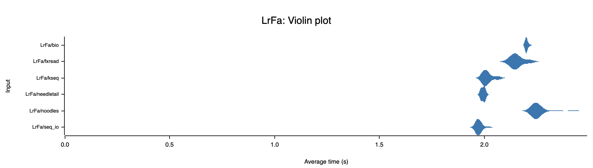
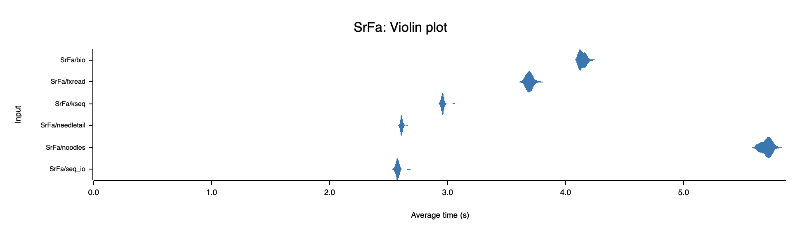
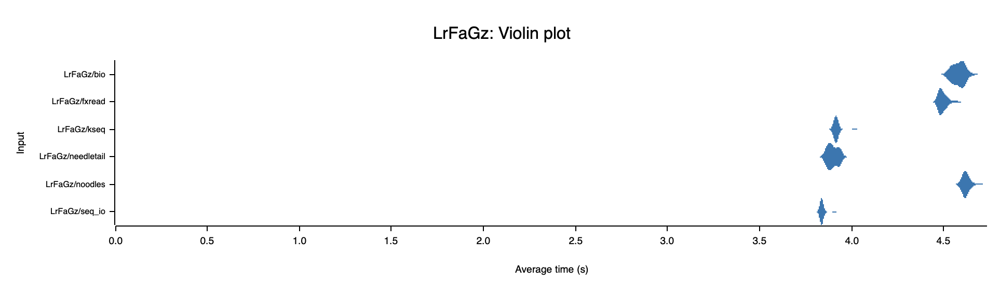
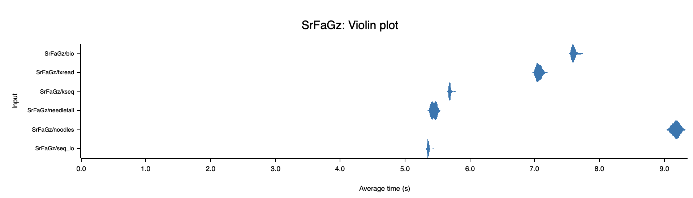
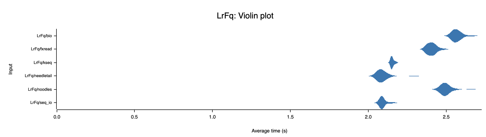
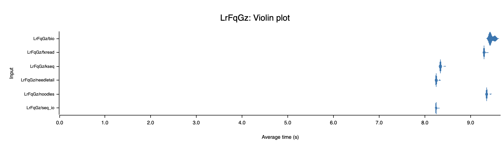
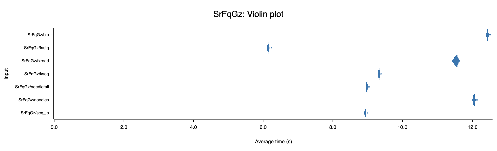

## FASTA Violin Plots
The violin plot shows the runtime distribution for iterating over entire FASTA files in both short-read and long-read datasets, including compressed and uncompressed files.

### Uncompressed FASTA Violin Plot

 
 

### GZ compressed FASTA Violin Plot

 
  

[Back to FASTA Reader Report](fastx_benchmarks.md#fasta-reader-report)
    

## FASTQ Violin Plots
The violin plot shows the runtime distribution for iterating over entire FASTQ files in both short-read and long-read datasets, including compressed and uncompressed files.

#### Uncompressed FASTQ Violin Plot

 
 

#### GZ compressed FASTQ Violin Plot

 
  

[Back to FASTQ Reader Report](fastx_benchmarks.md#fastq-reader-report)